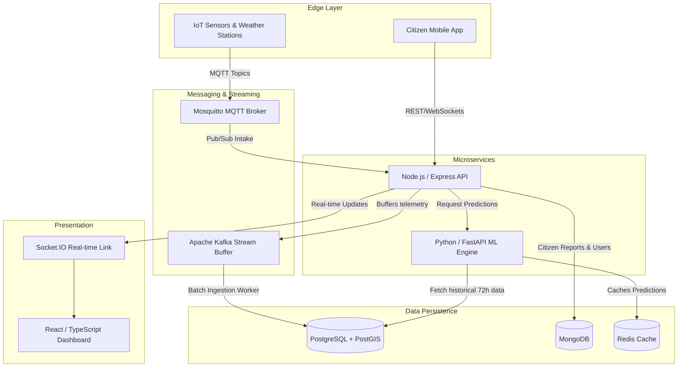
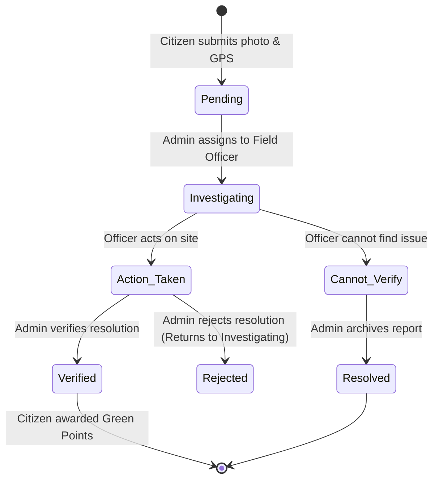
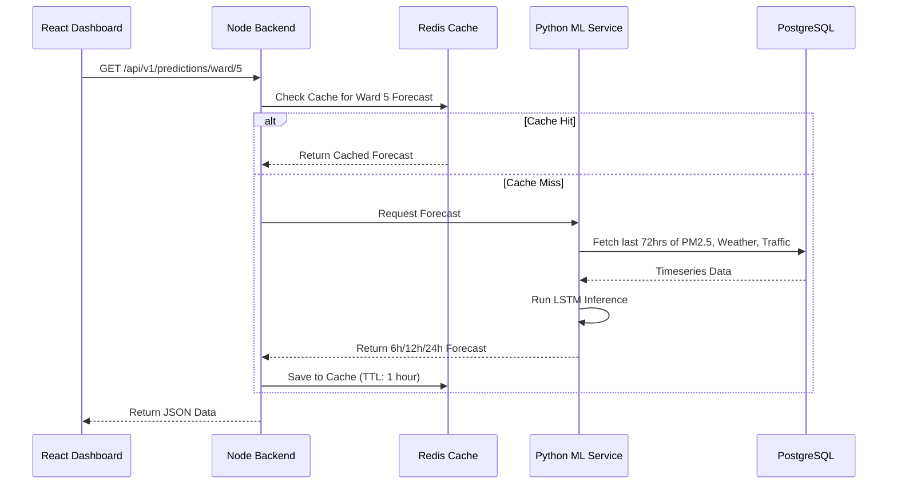

# 🌿 Smart City AQI & Pollution Mitigation Platform

> A production-grade, AI-powered environmental monitoring platform designed to ingest high-throughput telemetry, run predictive machine learning models, and empower citizens and officers to mitigate pollution hotspots in real time.

---

## 🎯 Architecture & Data Flow Overview

This system orchestrates 8 microservices handling everything from real-time IoT ingestion to geospatial hotspot clustering. 

### 1. High-Level Architecture Flowchart



---

## 🔄 Core Processes & Lifecycles

### 1. The Citizen Incident Report Lifecycle
When a citizen spots a pollution violation (e.g., illegal garbage burning), they submit a report that flows through a strict state-machine managed by Officers and Admins.



### 2. Machine Learning Data Flow
The AI engine runs three core models: AQI Forecasting (LSTM), Hotspot Clustering (DBSCAN), and Source Apportionment (XGBoost).



---

## 🔐 Strict Role-Based Access Control (RBAC)

The platform guarantees secure operational boundaries using JWT Bearer tokens and strict route guards.

| Role | Interface | Key Capabilities |
| :--- | :--- | :--- |
| **Citizen** | Public UI | • View live city-wide and ward AQI metrics.<br>• Submit geotagged pollution reports.<br>• Track report resolution and gamified 'Green Points'. |
| **Field Officer** | Internal Staff | • Dashboard focused entirely on **actionable items**.<br>• View reports specifically assigned to them by admins.<br>• Update report statuses on the ground (e.g. `action_taken`).<br>• Access route-planning and hotspot map overlays. |
| **Admin** | Command Center | • **Full system control and oversight.**<br>• Review reports and assign them to specific Officers.<br>• Conduct final verification of solved issues.<br>• Manage User accounts (Promote/Demote/Disable).<br>• Access "AI Copilot" capabilities for rapid data synthesis.<br>• Trigger emergency SMS/Push alert broadcasts. |

---

## ⚡ Quick Start Deployment (Docker)

The recommended way to run this suite is via `docker compose`.

```bash
# 1. Clone the repository
cd aqi-project

# 2. Configure secrets and variables
cp .env.example .env
# Edit .env: Set secure PG_PASS, JWT_SECRET, and ML_API_KEY.

# 3. Spin up the orchestration stack (Frontend, Backend, ML, DBs, Brokers)
docker compose up --build -d

# 4. Generate Telemetry (Simulates 10 IoT Sensors)
cd tools
npm install mqtt
node sensor-simulator.js

# 5. Access the Platform
open http://localhost:3000

# Default Accounts
# Admin: admin@aqi.gov.in / Admin@123
# Officer: officer1@aqi.gov.in / Officer@123
```

---

## 🛠️ Bare-Metal Local Development

If you prefer to run services manually for debugging:

### Prerequisites
- Node.js 18+ & Python 3.11+
- PostgreSQL 15 + PostGIS
- MongoDB 6+ & Redis Server
- Mosquitto MQTT & Apache Kafka

### Startup Sequence

**1. Database Initialization**
```bash
createdb aqi_db
psql -d aqi_db -c "CREATE EXTENSION postgis;"
psql -d aqi_db -f database/schema.sql
```

**2. Node.js Backend (Port 5000)**
```bash
cd backend
npm install
npm run dev
```

**3. Python ML Engine (Port 8000)**
```bash
cd ml-service
python -m venv venv && source venv/bin/activate
pip install -r requirements.txt
uvicorn app.main:app --reload --port 8000
```

**4. React Dashboard (Port 3000)**
```bash
cd frontend
npm install
npm start
```

---

## 🔌 API Reference Guide

*All endpoints under `/api/v1/*` (except `/auth/login` and `/aqi/map`) require a valid `Bearer <Token>`.*

### Authentication & Users
- `POST /auth/login` — Authenticate and retrieve JWT.
- `GET /auth/users` — **[Admin]** Retrieve all registered users.
- `PATCH /auth/users/:id` — **[Admin]** Update a user's role or operational ward.

### Telemetry & AQI
- `GET /aqi/map` — GeoJSON polygon export of current city-wide AQI.
- `GET /aqi/ward/:id` — Drill down into a specific ward's historical sensor data.

### Report Management
- `POST /reports` — **[Citizen]** Submit a new violation report.
- `GET /reports` — **[Admin, Officer]** List reports (filtered by assigned officer, status).
- `PATCH /reports/:id/assign` — **[Admin]** Assign report to an officer.
- `PATCH /reports/:id/action` — **[Officer, Admin]** Update investigative status.

### Machine Learning
- `GET /predictions/ward/:id` — Fetch LSTM time-series forecast.
- `GET /predictions/hotspots` — Run DBSCAN cluster analysis on live anomalies.
- `GET /predictions/source/:id` — Run XGBoost source apportionment.

---

## 📁 Directory Structure

```text
aqi-project/
├── backend/                   # Node.js API
│   └── src/
│       ├── routes/            # REST API controllers
│       ├── services/          # MQTT, Kafka, Cron Jobs
│       ├── models/            # Mongoose schemas
│       └── middleware/        # JWT Auth & Role Guards
├── ml-service/                # Python FastAPI
│   └── app/
│       └── models/            # LSTM, XGBoost, DBSCAN implementations
├── frontend/                  # React + TypeScript UI
│   └── src/
│       ├── pages/             # Role-specific dashboard views
│       ├── components/        # Glassmorphism UI, Charts, Maps
│       └── context/           # Auth, Sockets, and Theme Context
├── database/                  # PostGIS schemas
├── docker-compose.yml         # Container definitions
└── tools/                     # IoT Simulation Scripts
```

---
*Built for the future of sustainable, data-driven smart cities.*
