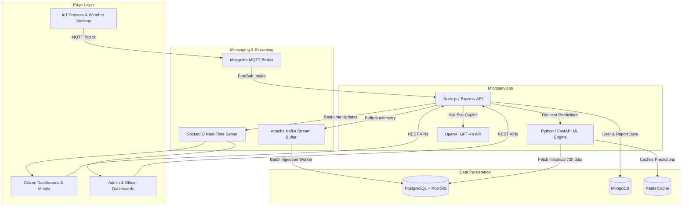
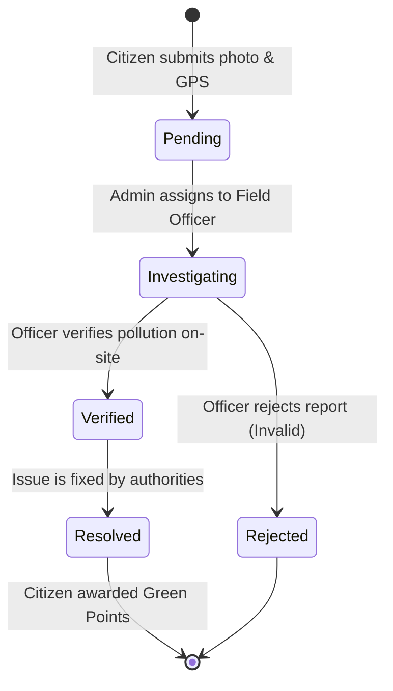
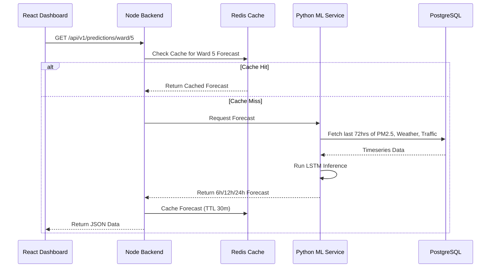

# 🌿 Smart City AQI & Pollution Mitigation Platform

> A production-grade, AI-powered environmental monitoring platform designed to ingest high-throughput telemetry, run predictive machine learning models, and empower citizens and officers to mitigate pollution hotspots in real time.

---

## 🎯 Architecture & Data Flow Overview

This system orchestrates multiple microservices handling everything from real-time IoT ingestion to geospatial hotspot clustering, and AI-driven Copilot assistance. 

### 1. High-Level Architecture Flowchart



---

## 🔄 Core Processes & Lifecycles

### 1. The Citizen Incident Report Lifecycle
When a citizen spots a pollution violation (e.g., illegal garbage burning), they submit a report that flows through a strict state-machine managed by Officers and Admins, powered entirely by Real-Time WebSockets for instant UI updates.



### 2. Machine Learning Data Flow
The AI engine runs three core models: AQI Forecasting (LSTM), Hotspot Clustering (DBSCAN), and Source Apportionment (XGBoost).



---

## 🚀 Key Features

### 1. 🤖 Eco-Copilot & AI Health Advisory
Integrated directly with **OpenAI's GPT-4o API**, the platform includes a floating **Eco-Copilot Widget** for Admins and Officers. They can ask questions about current hotspots, sensor statuses, and pollution mitigation strategies.
For Citizens, the platform generates a **Personalized Health Advisory** based on the real-time PM2.5 and AQI levels in their local ward, giving them actionable advice on whether it's safe to exercise outdoors.

### 2. ⚡ True Real-Time Tracking
The platform operates on a robust **Socket.IO** backbone. When an incident report is submitted, Admins see it instantly pop up on their dashboard. When an Admin assigns it to an Officer, the Officer receives an instant notification. And when an Officer verifies the report on-site, the Citizen's dashboard updates live, awarding them Green Points for their contribution. No refreshing required.

### 3. 🎮 Gamification & Green Points
Citizens are incentivized to keep their city clean through a Gamification system. Submitting valid, verified pollution reports earns Citizens **Green Points**. These points dictate their Reward Level, turning civic duty into an engaging and competitive ecosystem.

### 4. 📊 Multi-Role Dashboards
- **Citizen Dashboard**: Focuses on Health Advisories, Ward AQI, and tracking personal pollution incident reports.
- **Officer Dashboard**: A streamlined queue of assigned cases, allowing field officers to quick-verify or reject reports from their mobile devices.
- **Admin Dashboard**: A comprehensive birds-eye view of the city. Features real-time server health (Postgres, Mongo, ML Service), overall report statistics, and ward rankings.

---

## 🛠 Tech Stack

- **Frontend**: React 18, TypeScript, Recharts (Data Visualization), Socket.IO-Client
- **Backend**: Node.js, Express, Mongoose, Sequelize, Socket.IO
- **Machine Learning**: Python, FastAPI, Scikit-Learn, PyTorch
- **Database**: PostgreSQL (Telemetry & Sensors), MongoDB (Users & Reports), Redis (Caching)
- **Streaming & Brokers**: Apache Kafka, Eclipse Mosquitto (MQTT)
- **Infrastructure**: Docker & Docker Compose

---

## 📦 Running Locally

The entire system is containerized and orchestrated via Docker Compose.

```bash
# 1. Clone the repository
git clone https://github.com/your-org/localaqidashboard.git

# 2. Add your OpenAI API Key to the .env file
echo "OPENAI_API_KEY=your_key_here" >> .env

# 3. Build and launch all 8 microservices
docker compose up -d --build
```

**Services will be available at:**
- **Frontend Dashboard**: `http://localhost:3000`
- **Node.js API Backend**: `http://localhost:5000`
- **Python ML Service**: `http://localhost:8000`

---

## 🐛 Recent Patches & Stability Fixes
- **MongoDB Healthchecks**: Hardened MongoDB boot-up sequences to prevent dependency race conditions that occasionally took down the backend API.
- **Socket Authentication**: Resolved room-assignment race conditions that previously prevented Citizens from receiving real-time status updates on their incident reports.
- **Dashboard Polling Optimization**: Replaced outdated 30-second polling hooks on Admin/Officer dashboards with instant Socket.IO invalidation hooks, dramatically reducing server load and ensuring absolute real-time accuracy.
