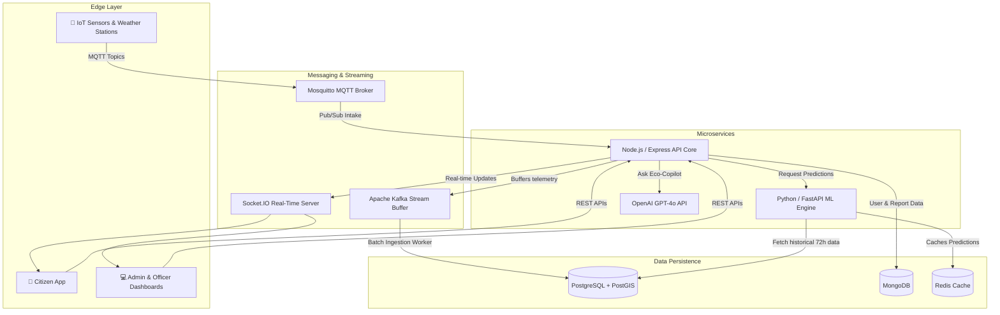
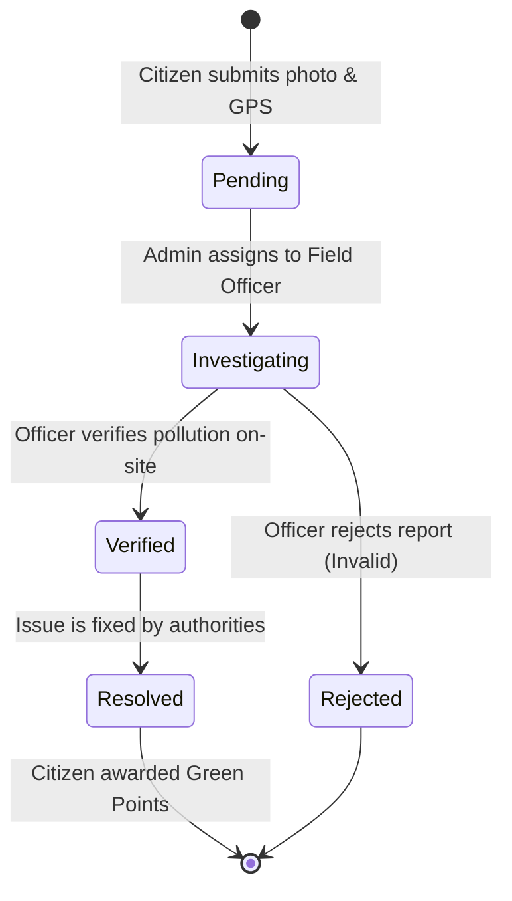
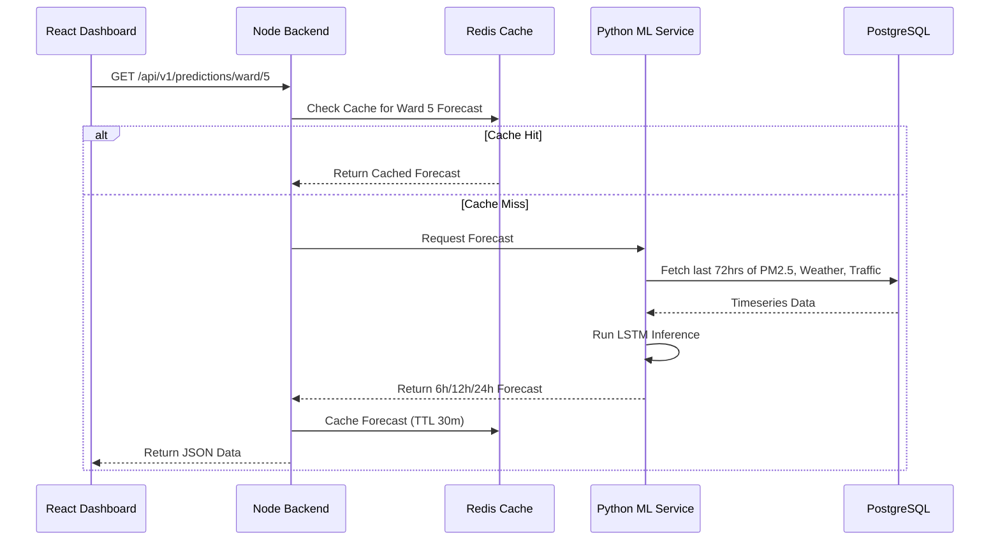

<div align="center">
  
  
  

  <h1>🌿 Smart City AQI & Pollution Mitigation Platform</h1>
  
  <p><b>A production-grade, AI-powered environmental monitoring ecosystem.</b></p>
  <p>Designed to ingest high-throughput telemetry, run predictive machine learning models, and empower citizens and officers to mitigate pollution hotspots in absolute real time.</p>
</div>

---

## 🌟 Vision & Impact

Urban air quality is a silent crisis. This platform tackles the problem by decentralizing pollution monitoring. It combines **IoT Sensor Telemetry**, **AI-driven Analytics (GPT-4o + XGBoost)**, and **Civic Crowdsourcing** to create a living, breathing digital twin of the city's air quality. 

Instead of just displaying data, this platform drives **Action** through a gamified reporting pipeline and real-time officer dispatch.

---

## 🎯 High-Level Architecture

The platform operates as a distributed system with 8 distinct microservices, orchestrated via Docker.



---

## 🚀 Key Features

### 1. 🤖 Eco-Copilot & AI Health Advisory
Integrated directly with **OpenAI's GPT-4o API**, the platform acts as an intelligent assistant.
- **For Admins & Officers**: A floating **Eco-Copilot Widget** allows staff to ask complex operational questions about current hotspots, sensor statuses, and pollution mitigation strategies in natural language.
- **For Citizens**: An **AI Health Advisory** dynamically generates personalized, actionable advice based on the real-time PM2.5 and AQI levels in their specific ward (e.g., "High PM2.5 detected in your area; avoid outdoor workouts today").

### 2. ⚡ True Real-Time Tracking
The platform operates on a robust **Socket.IO** backbone with zero polling lag. 
- When an incident report is submitted, Admins see it instantly pop up on their dashboard. 
- When an Admin assigns it to an Officer, the Officer receives a live notification. 
- When an Officer verifies the report on-site, the Citizen's dashboard updates live. 

### 3. 🎮 Gamification & Green Points
Civic duty is transformed into an engaging ecosystem. Citizens earn **Green Points** by submitting valid pollution reports (e.g., illegal garbage burning). Once an Officer verifies the report on the ground, the citizen's points are credited, unlocking higher **Reward Levels** and community rankings.

### 4. 📊 Multi-Role Dashboards
- **🧑‍🤝‍🧑 Citizen Dashboard**: Focuses on Health Advisories, Ward AQI, and tracking personal pollution incident reports.
- **👮 Officer Dashboard**: A streamlined queue of assigned cases, allowing field officers to quick-verify, escalate, or reject reports from their mobile devices while on-site.
- **👑 Admin Dashboard**: A comprehensive birds-eye view of the city. Features real-time server health (Postgres, Mongo, ML Service), overall report statistics, and ward pollution rankings.

---

## 🔄 Core Lifecycles

### The Citizen Incident Report Lifecycle
Powered entirely by WebSockets for instant UI state transitions across all three user roles.



### Machine Learning Data Flow
The AI engine runs three core models: AQI Forecasting (LSTM), Hotspot Clustering (DBSCAN), and Source Apportionment (XGBoost).



---

## 🛠 Tech Stack

| Domain | Technologies |
| :--- | :--- |
| **Frontend** | React 18, TypeScript, Recharts, Socket.IO-Client, Context API |
| **Backend Core** | Node.js, Express, Mongoose, Sequelize, Socket.IO, JWT |
| **Machine Learning** | Python, FastAPI, Scikit-Learn, PyTorch, XGBoost |
| **Databases** | PostgreSQL (Timeseries), MongoDB (Documents), Redis (Caching/PubSub) |
| **Streaming Brokers**| Apache Kafka, Eclipse Mosquitto (MQTT) |
| **Infrastructure** | Docker, Docker Compose, Nginx |
| **AI Integration** | OpenAI GPT-4o API |

---

## 📦 Running Locally

The entire system is containerized and orchestrated via Docker Compose for zero-configuration startup.

```bash
# 1. Clone the repository
git clone https://github.com/pankeshbhagore/Local-AQI-Dashboard.git
cd Local-AQI-Dashboard

# 2. Configure Environment Variables
# Add your OpenAI API Key to the .env file for Eco-Copilot features
echo "OPENAI_API_KEY=your_openai_api_key_here" >> .env

# 3. Build and launch all 8 microservices
docker compose up -d --build
```

### 🌐 Access Points
Once the containers are healthy, access the services here:
- **Frontend App**: [http://localhost:3000](http://localhost:3000)
- **Backend API**: [http://localhost:5000](http://localhost:5000)
- **ML Inference API**: [http://localhost:8000](http://localhost:8000)

> **Note**: For initial testing, you can register a new account on the frontend. The first registered user may need their role manually upgraded to `admin` in MongoDB to access the Admin Dashboard.

---

## 🛡️ Stability & Performance
- **Resilient Boot Sequences**: Implements hardened MongoDB and Postgres health checks to prevent dependency race conditions.
- **WebSocket Optimization**: Employs strictly isolated Socket.IO rooms (`staff`, `citizen:<id>`, `officer:<id>`) to prevent broadcast flooding and ensure O(1) message delivery.
- **Cache-First Architecture**: Aggressive Redis caching on all heavy analytical and ML inference endpoints guarantees <50ms response times on the frontend dashboards.

<div align="center">
  <i>Built with ❤️ for a cleaner, smarter future.</i>
</div>
